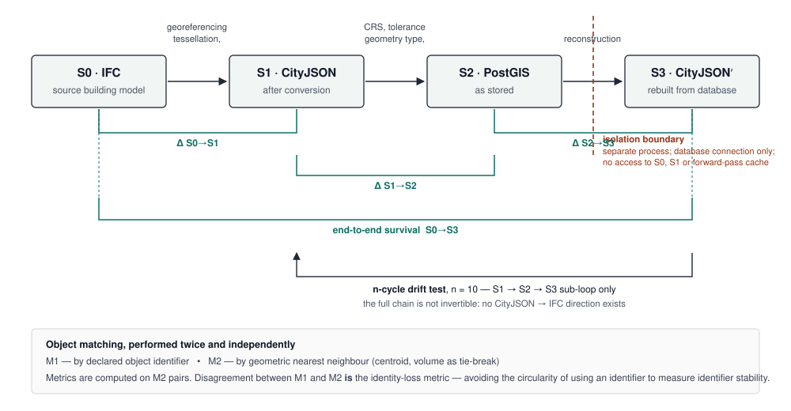
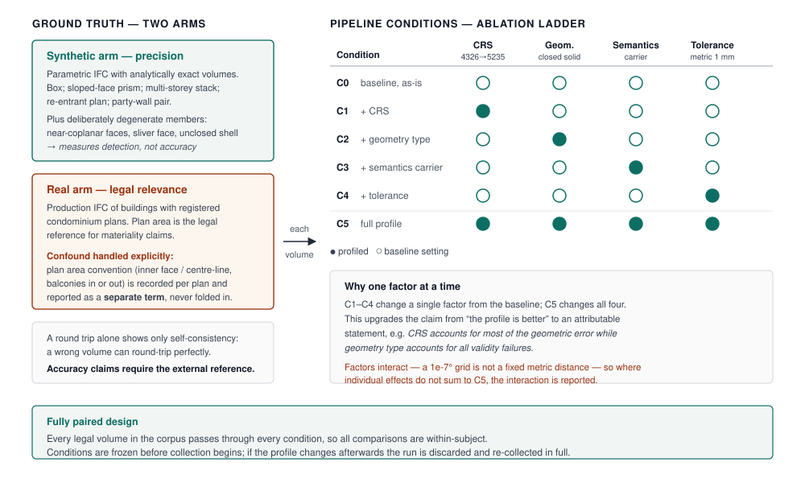
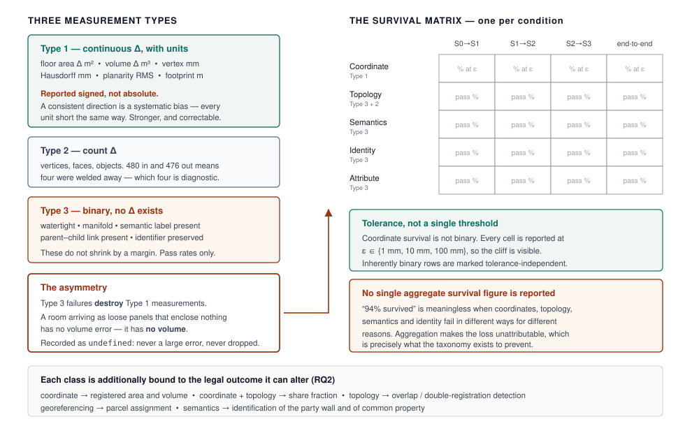

# How Much of a Legal Volume Survives? Measuring Encoding Loss Across the IFC–CityJSON–PostGIS Chain in a 3D Cadastre

**Target venue:** ISPRS International Journal of Geo-Information (IJGI). MDPI numbered citation style.
**Companion documents:** `PAPER1_ROUNDTRIP_PROBLEM.md` (problem framing and locked scope), `PAPER1_METHOD.md` (method design), `PAPER1_CORPUS_PLAN.md` (corpus acquisition).
**Draft status:** Sections 1–3 drafted 2026-08-30. Figures 1–3 are in `figures/`. Every reference resolved against a DOI, publisher record or institutional repository entry; none are placeholders. Items still requiring the authors' input are flagged at the end.

> **Abstract** — *to be written last, once results exist.*

---

## 1. Introduction

Land administration has, for most of its history, recorded property as a figure on a plane. A parcel boundary is surveyed, adjusted against a tolerance, and registered; the vertical extent of the right is left implicit. Dense urban development has made that implicit dimension untenable. Apartments, subterranean car parks, utility corridors and air rights are separate properties stacked over a single footprint, and they cannot be distinguished from one another on a two-dimensional plan. The response, developed over two decades of research and now embodied in the Land Administration Domain Model (LADM), is to register the property as a *legal space* — a bounded volume to which rights, restrictions and responsibilities attach [1].

LADM is a conceptual model, not an encoding. Edition I (ISO 19152:2012) defined the `LA_SpatialUnit` hierarchy and its 3D specialisations without prescribing how a legal volume should be represented in a file or a database. Edition II restructures the standard into multiple parts and strengthens its 3D content [1]. Five of those parts are now published as International Standards — Part 1 (generic conceptual model), Part 2 (land registration), Part 3 (marine georegulation), Part 4 (valuation information) and Part 5 (spatial plan information) [2]. Implementation aspects, however, are deferred to Part 6, which at the time of writing is still "under development in cooperation between OGC, ISO and FIG" [2] and is not published. In practice, therefore, an implementer building a 3D cadastre today has a normative model of *what* a legal volume is, and no normative statement of *how* it must be encoded, stored, or exchanged.

### 1.1. The encoding chain

Meanwhile the supply of 3D legal volumes has been largely settled by practice. The geometry of an apartment is not surveyed directly in the way a parcel boundary is; it originates in the building model prepared for design and construction, and reaches the registry through the open BIM exchange format IFC. Deriving legal spaces from `IfcSpace` entities is now an established approach [3], and recent prototypes take IFC directly as the input for registering apartment rights in a LADM-conformant system [4]. Between the building model and the registry sits a geospatial exchange format — increasingly CityJSON, a compact JSON encoding of the CityGML data model [5] — and, at the end, a spatial database, since a registry must query and constrain its holdings rather than merely store files [6].

The result is a chain of at least three representations:

**IFC → CityJSON → spatial DBMS.**

Each arrow is a re-encoding into a formalism with different primitives, different semantics and a different notion of what a volume is. IFC represents solids parametrically and by boundary representation, carries property sets, and organises objects through a containment hierarchy. Converting to a geospatial encoding requires tessellation, semantic remapping, and a georeferencing decision. The IFC schema provides for the latter through the entity *IfcMapConversion*, a subtype of *IfcCoordinateOperation* that carries the translation, rotation and scale relating the model's local engineering coordinate system to a projected map CRS. In practice, however, georeferencing information in IFC is neither reliably present nor reliably interpreted. The schema's provisions have been argued to be insufficient for unambiguous use across stakeholders and software [7], and the GeoBIM Benchmark found that tools store georeferencing parameters under differing rules, are "generally not transparent on the way the georeferencing is applied", apply those rules inconsistently across northing/easting, height and rotation, and in the tools tested could not reach the georeferencing level that *IfcMapConversion* itself supports [8]. Where the entity is missing or untrusted, the model must be placed by hand — and the absolute position of the legal volume becomes an assertion rather than a measurement. How often this occurs in a given corpus is itself measurable, and is reported as part of the results of this study.

Converting again into a spatial database means committing to the geometry types that database offers, which for most Simple Features-based systems means surface collections rather than validated closed solids, and means choosing a coordinate reference system in which all subsequent computation will occur.

None of these steps is neutral. Corner coordinates move. A shell that enclosed a volume in the source may arrive as an unordered set of faces that encloses nothing. The label identifying a particular face as a party wall has no destination and is dropped. The statement that a room belongs to a given apartment is flattened into a foreign key or a list of identifiers.

### 1.2. Why encoding loss is a legal problem, not a rendering problem

In visualisation, a few centimetres of displacement or a non-watertight shell is a cosmetic defect. In a cadastre it is not, because the geometry *is* the object of the right. Four consequences follow directly:

1. **Registered extent.** The floor area or volume computed from the stored geometry is the figure that describes what is owned.
2. **Share fractions.** In condominium ownership, an owner's share of common property is commonly derived from the ratio of unit extents; an error in one unit's volume redistributes shares across the whole building.
3. **Double registration.** Detecting that two exclusive rights have been registered over the same space is an intersection test on stored geometry. It cannot be performed on primitives that do not bound a volume.
4. **Parcel assignment.** Georeferencing error determines whether a legal volume is associated with the correct underlying parcel at all.

Two-dimensional cadastral surveying has long governed the analogous risk through explicit accuracy standards and misclosure tolerances: the permissible error is stated, and a plan that exceeds it is not registrable. No equivalent exists for the encoding of a three-dimensional legal volume. There is no stated tolerance and no statement of which properties must be preserved.

### 1.3. What is and is not already known

Three bodies of work bear on this, and each stops short of the question.

**Conversion quality between IFC and geospatial formats.** Automated IFC-to-CityGML conversion with attention to geometric and semantic correctness is well established [9], and later work pursues completeness through richer mapping mechanisms while conceding explicitly that "a fully complete and lossless conversion may never be achieved" [10]. Loss in this chain is not entirely unquantified: Liu and Ellul [11] measure volume and surface-area change for individual geometric primitives converted from BIM to GIS representations, reporting losses from a fraction of a percent to tens of percent depending on the export setting. That work is the closest existing precedent to the present study, and it also frames the problem correctly — that geometric loss, unlike semantic loss, had received little quantitative attention. It stops, however, at the level of the primitive and at a single conversion step. It does not follow a whole cadastral object through a chain, does not include a database, and does not ask whether the measured change is legally consequential.

**LADM and 3D land administration.** The conceptual model, its Edition II restructuring and its 3D capabilities are well developed [1], and BIM-sourced legal spaces have been demonstrated end-to-end in prototypes that validate incoming geometry and store it as LADM legal space building units [3,4]. These works *validate* — they check planarity, orientation, and overlaps — but validation asks whether the stored object is *acceptable*, not whether it is *the same object* that entered the pipeline. A dataset can be perfectly valid and still be the wrong volume.

**Geometric validity and 3D data storage.** Rigorous validation of 3D primitives against the ISO 19107 abstract specification is available and widely used [12], and a recent systematic review of 3D cadastral database systems finds that most database management systems support 3D spatial functions only partially, and names coordinate-system transformation and the loss of multiplicity attributes during conceptual-to-relational mapping among the recurring failures [13]. Again, the first measures *validity* and the second surveys *capability*; neither measures *fidelity* — the agreement between a representation and the representation it was derived from.

The gap is therefore specific rather than sweeping. The chain has been built and deployed; individual links have been studied for correctness, coverage, speed and — at primitive level — geometric change. What has not been done is to measure a *whole legal volume* across the *whole chain including the database*, to classify what is lost in a way that distinguishes deviation from destruction, and to state the minimum a legal volume must retain in order to remain registrable.

### 1.4. Objectives and research questions

This paper measures how much of a legal volume survives the encoding chain IFC → CityJSON → PostGIS, and uses that measurement to propose an encoding profile. Three questions structure the work:

- **RQ1.** What is lost, and at which stage of the chain?
- **RQ2.** Which of those losses are capable of changing a legal outcome — registered extent, share fraction, overlap detection, or parcel assignment?
- **RQ3.** What is the minimum set of constraints on each stage sufficient to make a legal volume round-trip faithfully and remain registrable?

### 1.5. Contributions

1. **A measurement method** for legal-volume fidelity across a multi-format encoding chain, in which a volume is compared against itself after re-encoding — so that the encoding is the only variable — and in which the return leg is reconstructed from the database alone, without access to the source.
2. **A loss taxonomy** on three axes — geometric, semantic and structural — that distinguishes continuous deviation from outright loss of a property, and binds each class to the legal outcome it is capable of altering.
3. **An encoding profile** for IFC → CityJSON → PostGIS, stated as format-level requirements and validated by re-running the same corpus through it under a factor-by-factor ablation, so that each requirement's contribution is attributable.

### 1.6. Structure of the paper

Section 2 reviews related work across 3D cadastre, BIM-sourced legal spaces, conversion, and 3D validity and storage. Section 3 presents the system under study and the measurement method — units of analysis, ground truth, pipeline conditions, the round-trip protocol and the metric set. Section 4 reports results as a survival matrix of property class against pipeline stage. Section 5 derives the loss taxonomy and the encoding profile and discusses legal materiality. Section 6 concludes.

---

## 2. Related Work

### 2.1. The legal volume as a registered object

Three-dimensional cadastre is a mature research field with two decades of accumulated literature, surveyed most recently by Paasch and Paulsson [14] and consolidated as international practice in the FIG best-practices compendium [15]. Kalogianni et al. [16] frame 3D land administration as a lifecycle with four components — acquisition, processing and validation, storage and management, and visualisation — and argue for continuity from BIM/IFC through to LADM. The encoding chain examined in this paper is one concrete instance of that lifecycle.

Real registrations and working prototypes now exist. The Netherlands registered multi-level property rights in 3D using BIM source data, with the Delft railway station as the first case [17]. Cemellini et al. [18] load Queensland volumetric parcels and building units into an LADM-compatible schema behind a web prototype. Aditya et al. [19] store Indonesian strata-title legal objects in PostGIS and serve them through Cesium, drawing on six real cadastral survey projects; Vučić et al. [20] develop a Croatian LADM profile with volumetric registration of building parts. For South Asia, Ghawana et al. [21] assess the status of 3D cadastre in Delhi and conclude that current practice is not yet adequate; no comparable published assessment exists for Sri Lanka, which is itself part of the motivation for the present work.

A parallel strand treats the quality of 3D cadastral objects. Shojaei et al. [22] and Asghari et al. [23] derive validation rules and a structured validation framework from the plan-examination practice of Victoria, Australia, and Višnjevac et al. [24] propose data-quality indicators — accuracy, precision, timeliness, consistency, completeness and relevancy — across a quality-management lifecycle for 3D cadastre. These are the nearest existing vocabulary for describing what can go wrong with a 3D legal object. They are, however, conformance frameworks: they classify an object as acceptable or not against stated rules. They do not compare an object with an earlier version of itself.

Finally, the notion of a *profile* is well established in this community. Kalogianni et al. [25] develop 3D spatial profiles supporting the full lifecycle of 3D objects, and a companion paper sets out a three-phase methodology for LADM country profiles comprising scope definition, profile creation and profile testing [26]. The contribution proposed here is of the same kind, but differs in how it is justified: the profile is derived from measured failures and validated by re-measurement, rather than by conformance argument.

### 2.2. BIM/IFC as the source of legal spaces

That legal spaces can be sourced from open BIM standards was established by Oldfield et al. [3], and the approach has since been implemented as a webservice taking IFC as registry input [4]. Atazadeh et al. [27] pursue the opposite architecture — extending IFC itself with LADM concepts so that legal and physical representations coexist in a single model — which is the principal alternative to the translate-and-measure approach taken here. Sun et al. [28] convert `IfcSpace` legal spaces into CityGML 3.0 and encounter the representational mismatch directly, substituting `BuildingUnit` because logical space cannot be instantiated, and stating plainly that "converting BIM to 3D city models without losing data is extremely difficult". Notably, their legal spaces reach only LoD1 solids while the building shell reaches LoD2 — a fidelity asymmetry that is described but not measured. Zamzuri et al. [29] provide a recent `IfcSpace`-to-LADM mapping for Malaysian strata registration, again as a proposed correspondence rather than a measured transformation.

An important qualification runs through this strand: the source geometry is frequently not trustworthy to begin with. Diakité and Zlatanova [30] observe that for `IfcSpace` in practice "it is common to have open volumes, inconsistent orientation of the object faces or intersecting volumes", and reconstruct watertight space volumes from bounding elements as a result. Lilis et al. [31] note that second-level space boundary data in IFC "are missing or incorrect" and derive them algorithmically. Broekhuizen et al. [4] test five real Dutch models against fitness criteria and find them systematically lacking georeference, `IfcSpace`, or links to legal attributes.

Loss, in other words, can precede conversion entirely. Any measurement study must therefore distinguish defects inherited from the source from defects introduced by the encoding — a distinction that motivates the synthetic control arm of the present method.

### 2.3. Conversion between IFC and geospatial encodings

Conversion methods span algorithmic pipelines [9], modular graph-transformation rule sets [32], schema mediation with an intermediate ontology [33], and triple graph grammars with an application domain extension to carry otherwise unmappable content [10]. Donkers et al. [9] are notable for an output-driven strategy that *modifies* geometry — applying a morphological closing operation — in order to force ISO 19107 validity in the output. That is a validity-for-fidelity trade made explicitly, and it is precisely the kind of trade this paper argues must be measured rather than assumed benign.

Attempts to characterise loss vary in rigour. El-Mekawy et al. [34] audit schema correspondence class by class and find that only a small minority of IFC product-extension classes map fully or partially to CityGML, concluding that substantial information is lost in transformation; the measurement is of schema coverage rather than of any particular object. Deng et al. [33] report comparatively that their models "kept almost all the geometry and semantic information" — an assessment whose imprecision illustrates the problem. Şenol and Gökgöz [35] address IFC-to-CityJSON specifically, claiming a 95% accuracy rate for converted semantic information while noting that openings are lost outright because CityJSON has no opening concept. Van der Vaart et al. [36] convert highly detailed BIM models to geospatial models at nine levels of detail and score each abstraction ordinally as correct, usable, or unusable, finding accuracy decreasing for volumetric and complex abstractions at higher LoDs. Liu and Ellul [11] provide the only metric treatment, at the level of individual primitives.

Independently of any single converter, the GeoBIM benchmark established that tool support is itself inconsistent: the same standardised datasets pushed through different IFC tools "yield inconsistent results" with few detectable common patterns [37], and the companion study documented undocumented weaknesses in CityGML tooling [38]. Practical accounts of BIM-to-GIS processing report self-intersections and inter-object intersections as the most common defects and note that surfaces forming a building's exterior are not explicitly marked as such in IFC [39]. Reviewing the field as an information-flow problem, Zhu and Wu [40] identify representation transformation and semantics mapping as the unsolved core.

The level-of-detail literature supplies a methodological template. Biljecki et al. [41] show the five CityGML LoDs to be insufficient and ambiguous and propose a refined specification, and demonstrate separately that two models of the same building at nominally the same LoD, differing only in geometric reference, yield substantially different results in spatial analyses including volume computation — with the geometric reference sometimes mattering more than the LoD [42]. The present study applies the same logic one layer down: not which abstraction was chosen, but what the encoding did to the abstraction that was chosen.

### 2.4. Validity, encoding and storage of 3D geometry

What it means for a solid to be valid under ISO 19107 — planarity, consistent orientation, shell closure, absence of self-intersection — was set out by Ledoux [43], who found that all 567 buildings in one national test set were invalid and roughly a fifth of a Berlin dataset likewise. The large-scale picture is worse still: across 37 CityGML datasets from nine countries, comprising 40 million surfaces, Biljecki et al. [44] report that error-free datasets are rare, that LoD2 solids in some datasets are wholly invalid, and — critically for the present argument — that most planarity errors arise from "deviations of just a few centimetres". Encoding noise at centimetre scale is therefore sufficient to destroy validity, which is exactly the regime in which a legal volume is measured.

Repair techniques exist — shrink-wrapping for building solids [45], triangulation-based repair for polygons benchmarked against the database's own `ST_MakeValid` [46] — but repair is not neutral. Shrink-wrapping guarantees a watertight exterior at the cost of discarding interior structure and small features. Repair is therefore itself a lossy re-encoding, and belongs inside a loss taxonomy rather than outside it.

The single closest methodological precedent for measuring agreement with a source is Dukai et al. [47], who assess a nationwide automatically reconstructed 3D building dataset by defining *relative* quality metrics against the source registers and point cloud in the absence of ground truth, reporting both validity rates and model-to-source RMS distances, and finding unclosed shells to account for the overwhelming majority of invalid cases. That study measures a reconstruction against its input; this one measures an encoding against its input.

On the encoding side, CityJSON [5] reports substantial compactness gains over CityGML and lossless conversion between the two encodings, but that guarantee is scoped — notably excluding the interior level of detail in which a cadastral legal volume would live. CityGML 3.0 [48] introduces the space and space-boundary paradigm together with logical subdivisions such as `BuildingUnit`, and removes LoD4 in favour of interiors integrated across the remaining levels. For storage, 3DCityDB provides the reference relational mapping of the CityGML model into PostGIS and Oracle Spatial [49], recently reworked for CityGML 3.0 with database-native geometry types [50]; cjdb offers a deliberately minimal JSONB-based alternative [6]. Within cadastre specifically, Tekavec et al. [51] store a large procedurally generated 3D cadastral dataset in PostGIS with SFCGAL and run 3D spatial integrity checks in SQL, arguing that such checks belong at insertion time — the nearest existing precedent for database-side validation of legal volumes. The systematic review by Shahidinejad et al. [13] finds only a minority of the 3D cadastre database literature addresses database design at all, and reports that most systems support 3D spatial functions partially at best.

Two further results bear directly on the conditions tested in this paper. Jaud et al. [52] quantify the consequences of expressing a locally authored building model in a projected geodetic CRS, showing map-projection and height-reduction distortions that can reach several centimetres over one hundred metres — which is why coordinate reference system is treated here as an experimental factor rather than an implementation detail. And Gillespie and Paudyal [53] re-encode the same cadastral plans in two competing formats and compare the outcome, which is methodologically the nearest analogue to the present design, though their comparison is qualitative.

### 2.5. Synthesis: the unmeasured span

Bringing the four strands together, the position is as follows.

- Loss in BIM-to-GIS conversion **has** been quantified, but at the level of geometric primitives and for a single conversion step [11]; elsewhere it is characterised qualitatively [10,34,40] or scored ordinally [36].
- Fidelity against a source **has** been measured, but for reconstruction from point clouds rather than for re-encoding along a format chain [47].
- Validity is measured extensively and at scale [43,44], but validity is not fidelity: a valid solid may be the wrong solid, and an invalid one may be geometrically closer to the truth.
- The database hop is, as far as the authors have been able to establish, unmeasured. The literature on 3D storage addresses schema design, capability and performance [6,13,49,50,51].
- No study binds any of these measurements to a legal outcome. The cadastral quality literature supplies indicators and rules [22,23,24] but stops at conformance.
- Profiles exist as design artefacts and are justified by conformance methodology [25,26] rather than by measuring what they preserve.

What is missing is therefore a single connected measurement: one legal volume, followed across the whole chain including the database, with losses classified so that deviation is distinguished from destruction, and with each class tied to the registered figure it is capable of changing. That measurement, and the encoding profile it justifies, are the subject of this paper.

---

## 3. Materials and Methods

### 3.1. Design overview

The study is a controlled, fully paired experiment. A corpus of legal volumes is passed through an encoding chain under six pipeline conditions, and each volume is compared against itself after re-encoding. Because the same volume traverses every condition, all comparisons are within-subject and the encoding is the only variable that differs. The measurement architecture is shown in **Figure 1**.

**Figure 1.** Measurement architecture. A legal volume is followed through four stages and compared against itself at each transition and end to end. The reconstruction S2→S3 executes behind an isolation boundary, with a database connection as its only input. Repeated cycling is possible only over the S1→S2→S3 sub-loop, because no CityJSON-to-IFC direction exists. Object pairing is performed twice, and the disagreement between the two pairings is itself the identity-loss metric.

Three commitments structure the design and are stated here because each excludes a weaker alternative.

First, **fidelity is measured internally, not against the deed.** The difference between a registered plan area and an area computed from the database is the sum of at least four independent quantities: the original survey error, the area-measurement convention of the plan, the divergence between the design model and the as-built structure, and the encoding loss. Only the last is under study, and it cannot be recovered from that sum. The measurement is therefore made between two representations of the same volume, where survey, convention and construction are held constant by construction. Registered figures enter the study later and in a different role, as the yardstick for materiality (§3.9).

Second, **a round trip alone establishes self-consistency, not correctness.** A pipeline can round-trip a wrong volume perfectly. Accuracy claims therefore require an external reference, and two are used (§3.4).

Third, **the profile is measured, not merely proposed.** A study of the current pipeline alone would be a defect report about one implementation. Comparing it against a profiled variant, under an ablation that changes one factor at a time, turns it into a controlled study whose conclusions are attributable to individual requirements.

### 3.2. The system under study

The measurements reported here are made on InfoBhoomi, a working land administration
Web-GIS built for Sri Lankan local government and structured on LADM. It is described in
some detail because a fidelity study measures a specific implementation, and a reader
cannot judge which findings generalise without knowing what was measured.

**Architecture.** A Django and Django REST Framework backend over PostgreSQL with PostGIS;
an Angular client using OpenLayers for the two-dimensional cadastral map and a WebGL viewer
for building interiors. Parcel geometry is held in EPSG:4326, with the Sri Lanka Grid
(EPSG:5235) used for planar computation.

**LADM implementation.** Spatial units follow the `LA_SpatialUnit` hierarchy, realised as
class-table inheritance with one geometry table per subtype, so that two-dimensional
parcels and three-dimensional building units share a hierarchy and are separated by
`LA_Level`. A legal space building unit carries a three-dimensional geometry column
alongside a unit type, a cadastral identifier, and a JSON column recording which room
volumes compose it. This composition mechanism is what allows several rooms to be
aggregated into one apartment, or into common property.

**The 3D import path — the object of measurement.** An IFC model is uploaded against a
target parcel. Geometry is tessellated with IfcOpenShell in world coordinates with vertex
welding enabled. A single transform pass then produces two outputs so that the
two-dimensional and three-dimensional records cannot drift apart: a CityJSON 2.0 document
whose vertices are in a local metric east–north–up frame with the geographic anchor held in
metadata, in which each `IfcSpace` becomes a room object; and, for the database, a building
footprint polygon together with one geometry per room, both expressed in EPSG:4326.

Three implementation decisions in that path are the substance of what this paper measures,
and none of them is unusual:

1. **Georeferencing is entered manually.** The importer solves a transform from an operator
   supplied anchor, rotation and scale. `IfcMapConversion` is not read, even where the
   source file provides it.
2. **Room volumes are stored as `MULTIPOLYGON Z` in a geographic CRS.** Horizontal
   coordinates are therefore in degrees while the vertical coordinate is in metres, and the
   geometry type is a surface collection that asserts nothing about closure.
3. **Coordinates are snapped to a fixed angular grid** of 1 × 10⁻⁷ degrees, adopted to keep
   results stable across GEOS versions.

**Why this system is a reasonable object of study.** It is a deployed implementation rather
than a demonstration, so its choices were made under the ordinary pressures of building a
registry: use the geometry types the database offers, store in the CRS the rest of the
system already uses, and place the model by hand because the source file cannot be trusted
to place it. Those are the defaults an implementer reaches for in the absence of a normative
encoding — which is precisely the situation LADM leaves them in until Part 6 exists [2].
Each of the three decisions above is therefore representative rather than idiosyncratic, and
each is separately addressed by a factor of the ablation in §3.5.

**Scope of the measurements reported.** The results in this paper exercise the conversion
and encoding path — the geometry emitted for storage — and, where stated, the database round
trip. Measurements that do not involve a live database instance are identified as such, so
that no claim about the database hop rests on an inference from the encoder alone.

**Generalisation.** Findings attributable to a format constraint hold for any implementation
choosing the same encoding; findings attributable to an implementation decision hold for
this system and for any other making the same decision. The paper distinguishes the two
throughout, and the encoding profile is stated as format-level requirements rather than as
calls into this codebase, so that it can be applied by an implementation sharing none of
InfoBhoomi's technology.

### 3.3. Units of analysis

The **legal volume** is the primary unit. It is the object to which rights attach, the object the registry identifies, and the unit in which every reported statistic and sample size is expressed. In the source model it originates as an `IfcSpace`; in the intermediate encoding it appears as a room-level city object; in the database it is a legal space building unit, possibly aggregated from several room volumes.

Two further levels are used as derived diagnostics, because three of the study's findings do not exist at volume level:

- The **face** is where semantic loss lives — whether a particular face was identifiable as a party wall — where planarity is measured, and where validity failures such as degenerate faces and unpaired edges are counted.
- The **building** is where the sum-of-parts check lives: private units plus common property should reconstitute the building envelope, with no gaps and no double counting.

The **parcel footprint link** is retained in scope but treated as an *attribute of the volume* rather than as a separate unit. Georeferencing error determines whether a volume is associated with the correct underlying parcel, which is a legal outcome rather than a geometric one. It is operationalised as a binary — does the volume's footprint fall within its registered parcel — together with the horizontal displacement of the footprint centroid in metres.

### 3.4. Corpus and ground truth

Two arms are used, shown on the left of **Figure 2**. They answer different questions and are analysed separately; results are never pooled.

**The synthetic arm supplies precision.** Parametrically generated IFC models with closed-form volumes isolate pipeline error from input error, since the true volume is known analytically rather than surveyed. The set comprises a rectangular box as control; a prism with a sloped upper surface, testing non-axis-aligned faces; a multi-storey stack, testing vertical adjacency and shared horizontal faces; a unit with a re-entrant plan, testing non-convexity; and a pair of units sharing a party wall, which carries both the semantic case and the sum-of-parts case. The set deliberately also includes degenerate members — near-coplanar faces, a sliver face, an unclosed shell. These are not discarded. They measure whether the pipeline *detects* invalidity or silently propagates it, which is a distinct and consequential behaviour given that source IFC is frequently defective in exactly these ways [30,31].

**The real arm supplies legal relevance.** Production IFC models of buildings with registered condominium plans provide the legal reference against which materiality is argued. This arm carries a confound capable of exceeding the effect under study. Registered plans state *areas* to a particular measurement convention — inner face or centre-line, balconies included or excluded — and where that convention differs from the boundary at which `IfcSpace` is defined, the resulting offset can be larger than any encoding error. The procedure is therefore: record the convention used by each plan; compute the convention offset independently, per unit; and report pipeline error and convention offset as separate terms. A model whose convention cannot be established is excluded from the accuracy analysis, though it may still contribute to the round-trip analysis, which does not depend on an external reference.

### 3.5. Pipeline conditions

Six conditions are defined, summarised in **Table 1** and shown as a ladder on the right of **Figure 2**. The baseline C0 is the pipeline as currently implemented. Conditions C1 to C4 each alter one factor; C5 applies all four.

**Figure 2.** Experimental design. Two ground-truth arms supply precision and legal relevance respectively; six pipeline conditions form a one-factor-at-a-time ablation ladder over the baseline. Every legal volume passes through every condition, giving a fully paired design.

**Table 1.** Pipeline conditions. C1–C4 alter a single factor relative to the baseline; C5 is the full profile.

| Id | Condition | CRS | Geometry type | Semantics carrier | Tolerance |
|----|-----------|-----|---------------|-------------------|-----------|
| C0 | Baseline (as-is) | EPSG:4326 | `MULTIPOLYGON Z` | dropped / partial columns | 1 × 10⁻⁷ ° grid snap |
| C1 | + CRS | EPSG:5235 | `MULTIPOLYGON Z` | dropped | equivalent grid |
| C2 | + geometry type | EPSG:4326 | closed `POLYHEDRALSURFACE Z`, validated | dropped | 1 × 10⁻⁷ ° |
| C3 | + semantics carrier | EPSG:4326 | `MULTIPOLYGON Z` | per-face semantic array + property-set store | 1 × 10⁻⁷ ° |
| C4 | + tolerance | EPSG:4326 | `MULTIPOLYGON Z` | dropped | explicit 1 mm, applied in the projected frame |
| C5 | Full profile | EPSG:5235 | closed `POLYHEDRALSURFACE Z`, validated | per-face semantic array + property-set store | 1 mm metric |

The four factors are not chosen arbitrarily. The coordinate reference system is included because expressing a locally authored model in a projected geodetic system introduces map-projection and height-reduction distortions that have been quantified at up to a few centimetres over one hundred metres [52] — the same order as the deviations that destroy planarity in real datasets [44]. The geometry type is included because a surface collection carries no closure guarantee, and closure is a precondition for computing a volume at all. The semantics carrier is included because the party-wall identification and property-set content have no destination in a geometry column. The tolerance is included because a fixed angular grid corresponds to a different physical distance at every latitude and in every direction.

Conditions are **frozen before any measurement is collected**. If the profile is modified after collection begins, the affected run is discarded and re-collected in full; otherwise the study is no longer an experiment. Because a 1 × 10⁻⁷ ° grid is not a fixed metric distance, the CRS and tolerance factors are not independent, and interaction is expected. Where the individual effects of C1 to C4 do not sum to the effect of C5, the interaction is reported rather than suppressed.

### 3.6. Round-trip protocol

The chain and its measurement points are shown in **Figure 1**. Four stages are distinguished: the source IFC (S0), the CityJSON produced by conversion (S1), the representation as stored in PostGIS (S2), and a CityJSON reconstructed from the database (S3). Three transitions are measured — S0→S1, S1→S2, S2→S3 — together with the end-to-end comparison S0→S3.

**Isolation.** The reconstruction S2→S3 is a genuine reconstruction from the database and nothing else. It executes as a separate process whose only input is a database connection; it has no path to the source IFC, to the S1 CityJSON, or to any in-memory or on-disk cache produced by the forward pass. This is enforced by process separation and by a logged assertion over open file handles. The constraint is stated explicitly because any carry-over of source values inflates the survival rate, and a reader is entitled to know that it was prevented rather than assumed.

**Object matching.** Comparing a source volume with its reconstruction requires pairing them, but identifier stability is itself one of the properties under measurement — so pairing by identifier alone would be circular. Matching is therefore performed twice and independently: once by declared object identifier (M1), and once by geometric nearest neighbour using centroid proximity with volume as tie-break (M2). All metrics are computed on M2 pairs, and the disagreement between M1 and M2 constitutes the identity-loss metric.

**Repeated cycles.** Drift under repetition is tested with ten cycles, but over the S1→S2→S3 sub-loop only. The full chain is not invertible: no CityJSON-to-IFC direction exists, so a second cycle has no source model to begin from. A prediction is registered in advance. Under C0 the fixed angular grid should render the transform idempotent, with drift reaching a fixed point after one or two cycles; monotonic drift would instead indicate a repeated non-idempotent transform, of which a per-cycle reprojection between geographic and metric frames is the prime candidate. Either outcome is reportable, and stating the expectation beforehand distinguishes a test from an exploration.

### 3.7. Metrics

Not every loss is a difference. Three measurement types are distinguished, shown on the left of **Figure 3**, and conflating them would obscure the study's central finding.

**Figure 3.** Metric typology and the structure of the results matrix. Continuous deltas, count deltas and binary properties are measured differently and reported separately. Binary failures make continuous metrics undefined rather than large, which is why coordinate and topology occupy separate rows. Each cell of the matrix reports survival at three tolerances; no aggregate figure is reported.

**Type 1, continuous deltas.** Floor area (Δ m² and Δ %), volume (Δ m³ and Δ %), vertex displacement in millimetres reported as mean, 95th percentile and maximum, symmetric Hausdorff distance, per-face planarity RMS residual, and footprint centroid displacement in metres. These are reported **signed**. If tessellation systematically under-reports sloped or curved volumes, every registered unit is short in the same direction, and a bias of that kind is both a stronger result than scatter and a correctable one. Signed mean and spread are therefore reported separately.

**Type 2, count deltas.** Differences in vertex, face and object counts. A reduction from 480 to 476 vertices indicates four were welded away; which four, and whether they were structurally load-bearing for the shape, is a face-level diagnostic.

**Type 3, binary properties.** Watertight closure, manifoldness, orientation consistency, presence of a semantic surface label, presence of a parent–child link, preservation of an identifier. These do not diminish by a margin; they are present or absent, and are reported as pass rates.

The relationship between the types is asymmetric, and the asymmetry is consequential. **Type 3 failures destroy Type 1 measurements.** A room that arrives as a set of loose faces enclosing nothing does not have a volume error of 0.3 m³; it has no volume at all. Such cases are recorded as `undefined` — never as a large error, and never dropped from the sample, since dropping them would systematically remove the worst outcomes from the reported distribution. This is why coordinate and topology occupy separate rows of the results matrix. The full metric set is given in **Table 2**.

**Table 2.** Metrics by property class.

| Class | Metrics | Type |
|-------|---------|------|
| Coordinate | vertex displacement; symmetric Hausdorff distance; signed ΔV and ΔV/V; signed ΔA and ΔA/A; per-face planarity RMS; footprint centroid displacement | 1 |
| Topology | watertight closure; manifoldness; orientation consistency; self-intersection; vertex and face count delta | 3, with 2 for counts |
| Semantics | per-face semantic surface type retention; party-wall face identifiable; LADM class and RRR mapping retention | 3 |
| Identity | M1–M2 matching disagreement; parent–child link retention; unit composition membership retention | 3 |
| Attribute | property-set key–value retention rate; LoD declaration; CRS and georeferencing metadata; unit declaration; storey assignment | 3, as a rate |

### 3.8. The survival matrix

Results are reported as a matrix of property class against pipeline stage, one matrix per condition, shown schematically on the right of **Figure 3**. Each cell reports the percentage of volumes surviving at a stated tolerance ε, with ε ∈ {1 mm, 10 mm, 100 mm}, so that the tolerance at which survival collapses is visible rather than concealed by a single threshold. Rows that are inherently binary report a pass rate and are marked tolerance-independent.

No single aggregate survival figure is reported. Coordinates, topology, semantics and identity fail through different mechanisms and for different reasons; a combined percentage would make the loss unattributable, which is precisely what the taxonomy exists to prevent.

### 3.9. Legal materiality

RQ2 asks which losses can change a legal outcome, and requires a second classification of each metric against the registered figure it is capable of altering: coordinate deviation against registered floor area and volume; coordinate and topology together against condominium share fractions, which are derived from ratios of unit extents and therefore redistribute across a whole building when one unit changes; topology against overlap and double-registration detection, which cannot be performed at all on primitives that do not bound a volume; and georeferencing against parcel assignment. Numerical thresholds are taken from registration practice in the study jurisdiction and are stated with the results rather than assumed here.

### 3.10. Analysis

Because the design is fully paired, comparisons between conditions are within-subject. Error distributions are expected to be non-normal and heavy-tailed, with a small number of pathological units dominating, so paired comparisons use the Wilcoxon signed-rank test with medians and bootstrapped confidence intervals rather than parametric equivalents. Effect sizes and intervals are reported in preference to p-values alone. Individual outliers are reported rather than summarised away: in a cadastre, the tail is the point, since it is the individual unit whose registered extent is wrong that constitutes the failure. The synthetic and real arms are analysed separately throughout.

Legal volumes within a single building are not independent observations: they share a model author, an export configuration, a georeferencing decision and a construction geometry. In the real arm the **building** is therefore treated as the unit of independence while the volume remains the unit of measurement, using a mixed-effects specification with building as a random effect; the synthetic arm, whose model families are generated independently, is not affected.

### 3.11. Reproducibility and controlled variables

Versions of ifcopenshell, GEOS, PostGIS, PostgreSQL and the supporting geometry libraries are pinned and reported. GEOS in particular is treated as a controlled variable rather than an implementation detail, since its version demonstrably alters validity outcomes in this pipeline. The synthetic corpus generator, the metric harness and the condition definitions are published alongside the results.

### 3.12. Threats to validity

| Threat | Mitigation |
|--------|------------|
| Source IFC is itself non-manifold, leaving ground truth undefined | The synthetic arm supplies exact volumes; degenerate members measure detection rather than accuracy |
| Area-convention offset exceeds the pipeline error in the real arm | Convention recorded per plan, offset computed independently, both reported as separate terms (§3.4) |
| Survival rate inflated by carry-over from the forward pass | Process isolation with logged assertion over open file handles (§3.6) |
| Circular measurement of identifier stability | Dual matching M1/M2, with disagreement as the metric (§3.6) |
| Small sample in the real arm | Statistical claims rest on the synthetic arm; the real arm carries materiality |
| Generalisation beyond one implementation | The profile is stated as format-level requirements rather than as API calls, and the ablation isolates which requirement does the work |

---

## References

All entries below were verified against a DOI resolver, publisher record or institutional repository entry on 30 August 2026.

1. Kara, A.; Lemmen, C.; van Oosterom, P.; Kalogianni, E.; Alattas, A.; Indrajit, A. Design of the new structure and capabilities of LADM edition II including 3D aspects. *Land Use Policy* **2024**, *137*, 107003. doi:10.1016/j.landusepol.2023.107003
2. van Oosterom, P.; Kara, A.; Lemmen, C. The first five parts of LADM Edition II have been published as ISO standards now. In *Proceedings of the FIG/UN-Habitat Joint Land Administration Conference (3DLA2025)*, Florianópolis, Brazil, 3–5 November 2025; pp. 33–58.
3. Oldfield, J.; van Oosterom, P.; Beetz, J.; Krijnen, T.F. Working with open BIM standards to source legal spaces for a 3D cadastre. *ISPRS Int. J. Geo-Inf.* **2017**, *6*(11), 351. doi:10.3390/ijgi6110351
4. Broekhuizen, M.; Kalogianni, E.; van Oosterom, P. BIM/IFC as input for registering apartment rights in a 3D Land Administration System — a prototype webservice. *Land Use Policy* **2025**, *148*, 107368. doi:10.1016/j.landusepol.2024.107368
5. Ledoux, H.; Arroyo Ohori, K.; Kumar, K.; Dukai, B.; Labetski, A.; Vitalis, S. CityJSON: a compact and easy-to-use encoding of the CityGML data model. *Open Geospat. Data Softw. Stand.* **2019**, *4*, 4. doi:10.1186/s40965-019-0064-0
6. Powałka, L.; Poon, C.; Xia, Y.; Meines, S.; Yan, L.; Cai, Y.; Stavropoulou, G.; Dukai, B.; Ledoux, H. cjdb: a simple, fast, and lean database solution for the CityGML data model. In *Recent Advances in 3D Geoinformation Science: Proceedings of the 18th 3D GeoInfo Conference*; Springer: Cham, 2024; pp. 781–796. doi:10.1007/978-3-031-43699-4_47
7. Jaud, Š.; Clemen, C.; Muhič, S.; Borrmann, A. Georeferencing in IFC: meeting the requirements of infrastructure and building industries. *ISPRS Ann. Photogramm. Remote Sens. Spatial Inf. Sci.* **2022**, *X-4/W2-2022*, 145–152. doi:10.5194/isprs-annals-X-4-W2-2022-145-2022
8. Noardo, F.; Harrie, L.; Arroyo Ohori, K.; Biljecki, F.; Ellul, C.; Krijnen, T.; Eriksson, H.; Guler, D.; Hintz, D.; Jadidi, M.A.; Pla, M.; Sanchez, S.; Soini, V.-P.; Stouffs, R.; Tekavec, J.; Stoter, J. Tools for BIM-GIS integration (IFC georeferencing and conversions): results from the GeoBIM benchmark 2019. *ISPRS Int. J. Geo-Inf.* **2020**, *9*(9), 502. doi:10.3390/ijgi9090502
9. Donkers, S.; Ledoux, H.; Zhao, J.; Stoter, J. Automatic conversion of IFC datasets to geometrically and semantically correct CityGML LOD3 buildings. *Trans. GIS* **2016**, *20*(4), 547–569. doi:10.1111/tgis.12162
10. Stouffs, R.; Tauscher, H.; Biljecki, F. Achieving complete and near-lossless conversion from IFC to CityGML. *ISPRS Int. J. Geo-Inf.* **2018**, *7*(9), 355. doi:10.3390/ijgi7090355
11. Liu, A.H.; Ellul, C. Quantifying geometric changes in BIM-GIS conversion. *ISPRS Ann. Photogramm. Remote Sens. Spatial Inf. Sci.* **2022**, *X-4/W2-2022*, 185–192. doi:10.5194/isprs-annals-X-4-W2-2022-185-2022
12. Ledoux, H. val3dity: validation of 3D GIS primitives according to the international standards. *Open Geospat. Data Softw. Stand.* **2018**, *3*, 1. doi:10.1186/s40965-018-0043-x
13. Shahidinejad, J.; Kalantari, M.; Rajabifard, A. 3D cadastral database systems — a systematic literature review. *ISPRS Int. J. Geo-Inf.* **2024**, *13*(1), 30. doi:10.3390/ijgi13010030
14. Paasch, J.M.; Paulsson, J. Trends in 3D cadastre — a literature survey. *Land Use Policy* **2023**, *131*, 106716. doi:10.1016/j.landusepol.2023.106716
15. van Oosterom, P. (Ed.) *Best Practices 3D Cadastres — Extended Version*; International Federation of Surveyors (FIG): Copenhagen, 2018; 240 pp. ISBN 978-87-92853-64-6
16. Kalogianni, E.; van Oosterom, P.; Dimopoulou, E.; Lemmen, C. 3D land administration: a review and a future vision in the context of the spatial development lifecycle. *ISPRS Int. J. Geo-Inf.* **2020**, *9*(2), 107. doi:10.3390/ijgi9020107
17. Stoter, J.; Ploeger, H.; Roes, R.; van der Riet, E.; Biljecki, F.; Ledoux, H.; Kok, D.; Kim, S. Registration of multi-level property rights in 3D in the Netherlands: two cases and next steps in further implementation. *ISPRS Int. J. Geo-Inf.* **2017**, *6*(6), 158. doi:10.3390/ijgi6060158
18. Cemellini, B.; van Oosterom, P.; Thompson, R.; de Vries, M. Design, development and usability testing of an LADM compliant 3D cadastral prototype system. *Land Use Policy* **2020**, *98*, 104418. doi:10.1016/j.landusepol.2019.104418
19. Aditya, T.; Laksono, D.; Susanta, F.F.; Istarno; Diyono; Ariyanto, D. Visualization of 3D survey data for strata titles. *ISPRS Int. J. Geo-Inf.* **2020**, *9*(5), 310. doi:10.3390/ijgi9050310
20. Vučić, N.; Mađer, M.; Roić, M.; Vranić, S. Towards a Croatian 3D cadastre based on the LADM. *ISPRS Ann. Photogramm. Remote Sens. Spatial Inf. Sci.* **2017**, *IV-4/W4*, 399–409. doi:10.5194/isprs-annals-IV-4-W4-399-2017
21. Ghawana, T.; Bennett, R.; Zevenbergen, J.A.; Khandelwal, P.; Rahman, S. 3D cadastres in India: examining the status and potential for land administration and management in Delhi. *Land Use Policy* **2020**, *98*, 104389. doi:10.1016/j.landusepol.2019.104389
22. Shojaei, D.; Olfat, H.; Quinones Faundez, S.I.; Kalantari, M.; Rajabifard, A.; Briffa, M. Geometrical data validation in 3D digital cadastre — a case study for Victoria, Australia. *Land Use Policy* **2017**, *68*, 638–648. doi:10.1016/j.landusepol.2017.08.031
23. Asghari, A.; Kalantari, M.; Rajabifard, A. A structured framework for 3D cadastral data validation — a case study for Victoria, Australia. *Land Use Policy* **2020**, *98*, 104359. doi:10.1016/j.landusepol.2019.104359
24. Višnjevac, N.; Šoškić, M.; Mihajlović, R. Towards quality management procedures in 3D cadastre. *ISPRS Int. J. Geo-Inf.* **2024**, *13*(5), 160. doi:10.3390/ijgi13050160
25. Kalogianni, E.; Dimopoulou, E.; Thompson, R.J.; Lemmen, C.; Ying, S.; van Oosterom, P. Development of 3D spatial profiles to support the full lifecycle of 3D objects. *Land Use Policy* **2020**, *98*, 104177. doi:10.1016/j.landusepol.2019.104177
26. Kalogianni, E.; Janečka, K.; Kalantari, M.; Dimopoulou, E.; Bydłosz, J.; Radulović, A.; Vučić, N.; Sladić, D.; Govedarica, M.; Lemmen, C.; van Oosterom, P. Methodology for the development of LADM country profiles. *Land Use Policy* **2021**, *105*, 105380. doi:10.1016/j.landusepol.2021.105380
27. Atazadeh, B.; Olfat, H.; Rajabifard, A.; Kalantari, M.; Shojaei, D.; Marjani, A.M. Linking land administration domain model and BIM environment for 3D digital cadastre in multi-storey buildings. *Land Use Policy* **2021**, *104*, 105367. doi:10.1016/j.landusepol.2021.105367
28. Sun, J.; Mi, S.; Olsson, P.-O.; Paulsson, J.; Harrie, L. Utilizing BIM and GIS for representation and visualization of 3D cadastre. *ISPRS Int. J. Geo-Inf.* **2019**, *8*(11), 503. doi:10.3390/ijgi8110503
29. Zamzuri, A.; Abdul Rahman, A.; Hassan, M.I.; Alkan, M. The extraction of BIM/IFC model for LADM legal spaces. *Int. Arch. Photogramm. Remote Sens. Spatial Inf. Sci.* **2026**, *XLVIII-4/W17-2025*, 345–351. doi:10.5194/isprs-archives-XLVIII-4-W17-2025-345-2026
30. Diakité, A.A.; Zlatanova, S. Valid space description in BIM for 3D indoor navigation. *Int. J. 3-D Inf. Model.* **2016**, *5*(3), 1–17. doi:10.4018/IJ3DIM.2016070101
31. Lilis, G.N.; Giannakis, G.I.; Rovas, D.V. Automatic generation of second-level space boundary topology from IFC geometry inputs. *Autom. Constr.* **2016**, *76*, 108–124. doi:10.1016/j.autcon.2016.08.044
32. Tauscher, H.; Lim, J.; Stouffs, R. A modular graph transformation rule set for IFC-to-CityGML conversion. *Trans. GIS* **2021**, *25*(1), 261–290. doi:10.1111/tgis.12723
33. Deng, Y.; Cheng, J.C.P.; Anumba, C. Mapping between BIM and 3D GIS in different levels of detail using schema mediation and instance comparison. *Autom. Constr.* **2016**, *67*, 1–21. doi:10.1016/j.autcon.2016.03.006
34. El-Mekawy, M.; Östman, A.; Hijazi, I. An evaluation of IFC-CityGML unidirectional conversion. *Int. J. Adv. Comput. Sci. Appl.* **2012**, *3*(5), 159–171. doi:10.14569/IJACSA.2012.030525
35. Şenol, H.İ.; Gökgöz, T. Integration of building information modeling (BIM) and geographic information system (GIS): a new approach for IFC to CityJSON conversion. *Earth Sci. Inform.* **2024**, *17*(4), 3437–3454. doi:10.1007/s12145-024-01343-1
36. van der Vaart, J.; Arroyo Ohori, K.; Stoter, J. A methodology to convert highly detailed BIM models into 3D geospatial building models at different LoDs. *ISPRS Int. J. Geo-Inf.* **2025**, *14*(12), 465. doi:10.3390/ijgi14120465
37. Noardo, F.; Krijnen, T.; Arroyo Ohori, K.; Biljecki, F.; Ellul, C.; Harrie, L.; Eriksson, H.; Polia, L.; Salheb, N.; Tauscher, H.; van Liempt, J.; Goerne, H.; Hintz, D.; Kaiser, T.; Leoni, C.; Warchol, A.; Stoter, J. Reference study of IFC software support: the GeoBIM benchmark 2019 — Part I. *Trans. GIS* **2021**, *25*(2), 805–841. doi:10.1111/tgis.12709
38. Noardo, F.; Arroyo Ohori, K.; Biljecki, F.; Ellul, C.; Harrie, L.; Krijnen, T.; Eriksson, H.; van Liempt, J.; Pla, M.; Ruiz, A.; Hintz, D.; Krueger, N.; Leoni, C.; Leoz, L.; Moraru, D.; Vitalis, S.; Willkomm, P.; Stoter, J. Reference study of CityGML software support: the GeoBIM benchmark 2019 — Part II. *Trans. GIS* **2021**, *25*(2), 842–868. doi:10.1111/tgis.12710
39. Arroyo Ohori, K.; Diakité, A.; Krijnen, T.; Ledoux, H.; Stoter, J. Processing BIM and GIS models in practice: experiences and recommendations from a GeoBIM project in the Netherlands. *ISPRS Int. J. Geo-Inf.* **2018**, *7*(8), 311. doi:10.3390/ijgi7080311
40. Zhu, J.; Wu, P. BIM/GIS data integration from the perspective of information flow. *Autom. Constr.* **2022**, *136*, 104166. doi:10.1016/j.autcon.2022.104166
41. Biljecki, F.; Ledoux, H.; Stoter, J. An improved LOD specification for 3D building models. *Comput. Environ. Urban Syst.* **2016**, *59*, 25–37. doi:10.1016/j.compenvurbsys.2016.04.005
42. Biljecki, F.; Ledoux, H.; Stoter, J.; Vosselman, G. The variants of an LOD of a 3D building model and their influence on spatial analyses. *ISPRS J. Photogramm. Remote Sens.* **2016**, *116*, 42–54. doi:10.1016/j.isprsjprs.2016.03.003
43. Ledoux, H. On the validation of solids represented with the international standards for geographic information. *Comput.-Aided Civ. Infrastruct. Eng.* **2013**, *28*(9), 693–706. doi:10.1111/mice.12043
44. Biljecki, F.; Ledoux, H.; Du, X.; Stoter, J.; Soon, K.H.; Khoo, V.H.S. The most common geometric and semantic errors in CityGML datasets. *ISPRS Ann. Photogramm. Remote Sens. Spatial Inf. Sci.* **2016**, *IV-2/W1*, 13–22. doi:10.5194/isprs-annals-IV-2-W1-13-2016
45. Zhao, Z.; Ledoux, H.; Stoter, J. Automatic repair of CityGML LoD2 buildings using shrink-wrapping. *ISPRS Ann. Photogramm. Remote Sens. Spatial Inf. Sci.* **2013**, *II-2/W1*, 309–317. doi:10.5194/isprsannals-II-2-W1-309-2013
46. Ledoux, H.; Arroyo Ohori, K.; Meijers, M. A triangulation-based approach to automatically repair GIS polygons. *Comput. Geosci.* **2014**, *66*, 121–131. doi:10.1016/j.cageo.2014.01.009
47. Dukai, B.; Peters, R.; Vitalis, S.; van Liempt, J.; Stoter, J. Quality assessment of a nationwide data set containing automatically reconstructed 3D building models. *Int. Arch. Photogramm. Remote Sens. Spatial Inf. Sci.* **2021**, *XLVI-4/W4-2021*, 17–24. doi:10.5194/isprs-archives-XLVI-4-W4-2021-17-2021
48. Kutzner, T.; Chaturvedi, K.; Kolbe, T.H. CityGML 3.0: new functions open up new applications. *PFG — J. Photogramm. Remote Sens. Geoinf. Sci.* **2020**, *88*(1), 43–61. doi:10.1007/s41064-020-00095-z
49. Yao, Z.; Nagel, C.; Kunde, F.; Hudra, G.; Willkomm, P.; Donaubauer, A.; Adolphi, T.; Kolbe, T.H. 3DCityDB — a 3D geodatabase solution for the management, analysis, and visualization of semantic 3D city models based on CityGML. *Open Geospat. Data Softw. Stand.* **2018**, *3*, 5. doi:10.1186/s40965-018-0046-7
50. Yao, Z.; Nagel, C.; Kendir, M.; Willenborg, B.; Kolbe, T.H. The new 3D City Database 5.0 — advancing 3D city data management based on CityGML 3.0. *ISPRS Ann. Photogramm. Remote Sens. Spatial Inf. Sci.* **2025**, *X-4/W6-2025*, 241–248. doi:10.5194/isprs-annals-X-4-W6-2025-241-2025
51. Tekavec, J.; Lisec, A.; Rodrigues, E. Simulating large-scale 3D cadastral dataset using procedural modelling. *ISPRS Int. J. Geo-Inf.* **2020**, *9*(10), 598. doi:10.3390/ijgi9100598
52. Jaud, Š.; Donaubauer, A.; Heunecke, O.; Borrmann, A. Georeferencing in the context of building information modelling. *Autom. Constr.* **2020**, *118*, 103211. doi:10.1016/j.autcon.2020.103211
53. Gillespie, K.; Paudyal, D.R. LandXML and LandInfra: a technical comparison for 3D cadastre data modelling in New South Wales, Australia. *ISPRS Int. J. Geo-Inf.* **2026**, *15*(5), 207. doi:10.3390/ijgi15050207

**Standards cited in text**

- ISO 19152:2012, *Geographic information — Land Administration Domain Model (LADM)* (withdrawn, superseded by the multi-part Edition II).
- ISO 19152-1:2024, *… Part 1: Generic conceptual model*.
- ISO 19152-2:2025, *… Part 2: Land registration*.
- ISO 19152-3:2024, *… Part 3: Marine georegulation*.
- ISO 19152-4:2025, *… Part 4: Valuation information*.
- ISO 19152-5:2025, *… Part 5: Spatial plan information*.
- ISO 19152-6, *… Part 6: Implementation aspects* — under development, ISO/TC 211/WG 7; not published as of August 2026.
- ISO 19107, *Geographic information — Spatial schema*.
- buildingSMART. *IfcMapConversion*, IFC 4.3 documentation. Entity in IfcRepresentationResource; subtype of *IfcCoordinateOperation*; attributes Eastings, Northings, OrthogonalHeight, XAxisAbscissa, XAxisOrdinate, Scale.

---

## Open items for the authors

1. **Sri Lankan legal instrument.** §1.2 argues from condominium share fractions and registered extent. The Apartment Ownership Law and its amendments should be cited precisely (act number and year), together with whatever states how unit floor area is measured and how common-property shares are derived. Search results for these were non-academic and have deliberately not been cited.
2. **Sri Lankan cadastral accuracy standard.** §1.2 contrasts 2D misclosure tolerances with the absence of a 3D equivalent. A citation to the Survey Department's accuracy specification would make that contrast concrete.
3. **No published 3D cadastre work for Sri Lanka could be located.** Ghawana et al. [21] on Delhi is used as the regional anchor. If the paper is to claim novelty for the Sri Lankan context, that absence should be stated explicitly rather than implied.
4. **Publication years of ISO 19152 Parts 4 and 5.** The ISO catalogue lists both as 2025; van Oosterom et al. [2] give 2024. Confirm and make consistent before submission.
5. **Four references could not be verified and were therefore excluded**, though all appear directly relevant. Confirm through institutional access if wanted: Shahidinejad, Kalantari & Rajabifard, *Developing an integrated approach to validate 3D ownership spaces in complex multistorey buildings*, IJGIS, doi:10.1080/13658816.2022.2109159; *3D cadastral database implementation based on LADM edition II and IFC*, Survey Review, doi:10.1080/00396265.2025.2544404; *Land administration domain model and 3D land administration*, Survey Review, doi:10.1080/00396265.2025.2561263; Guo et al., *Developing a 3D cadastre for the administration of urban land use: a case study of Shenzhen, China*, Computers, Environment and Urban Systems, 2013. Publisher access was blocked in each case.
6. **El-Mekawy et al. [34]** appears in a low-tier venue (IJACSA). Its class-matching counts are widely reused, but consider whether to cite it or paraphrase the finding from a stronger source.
7. **InfoBhoomi availability.** §3.2 describes the system under study. Decide before
   submission whether the codebase, or the converter and metric harness alone, will be made
   available to reviewers — IJGI increasingly expects a data and code availability
   statement, and the reproducibility claim in §3.11 is weaker without one.
8. **Reference [29]** (Zamzuri et al.) and **[53]** (Gillespie & Paudyal) carry 2026 publication years against 2025 volume designations — normal for these series, but worth a final check.
